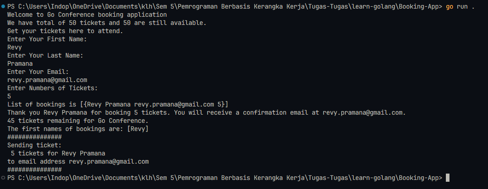

# Learn Golang

| **Name**     | **NRP**    |
| ------------ | ---------- |
| Revy Pramana | 5025221252 |

## Description

The Booking-App is a simple command-line application written in Go that allows users to book tickets for an event. Users can enter their details and the number of tickets they want to book. The application then processes the booking and provides a confirmation message.

## Details

### main.go

`main` Function:
This is the entry point of the application. It greets users, gets user input, validates the input, books the ticket if the input is valid, and sends a confirmation email.

```go
func main() {
	greetUsers()

	firstName, lastName, email, userTickets := getUserInput()
	isValidName, isValidEmail, isValidTicketNumber := validateUserInput(firstName, lastName, email, userTickets, remainingTickets)

	if isValidName && isValidEmail && isValidTicketNumber {
		bookTicket(firstName, lastName, email, userTickets)
		wg.Add(1)
		go sendTicket(firstName, lastName, email, userTickets)

		firstnames := getFirstnames()
		fmt.Printf("The first names of bookings are: %v\n", firstnames)

		if remainingTickets == 0 {
			// End program
			fmt.Println("Our conference is booked out. Come back next year.")
		}
	} else {
		if !isValidName {
			fmt.Println("First name or last name you entered is too short.")
		}
		if !isValidEmail {
			fmt.Println("Email address you entered doesn't contain @ sign.")
		}
		if !isValidTicketNumber {
			fmt.Println("Number of tickets you entered is invalid.")
		}
	}
	wg.Wait()

}
```

`greetUsers` Function: This function prints a welcome message to the users, including the total number of tickets and the number of remaining tickets.

```go
func greetUsers() {
	fmt.Printf("Welcome to %v booking application\n", conferenceName)
	fmt.Printf("We have total of %v tickets and %v are still available.\n", conferenceTickets, remainingTickets)
	fmt.Println("Get your tickets here to attend.")
}
```


`getFirstNames` Function: This function returns a slice of first names from the list of bookings.

```go
func getFirstnames() []string {
	firstNames := []string{}
	for _, booking := range bookings {
		firstNames = append(firstNames, booking.firstName)
	}
	return firstNames
}
```

`getUserInput` Function: This function prompts the user to enter their first name, last name, email, and the number of tickets they want to book. It returns these values.

```go
func getUserInput() (string, string, string, uint) {
	var firstName string
	var lastName string
	var email string
	var userTickets uint

	fmt.Println("Enter Your First Name: ")
	fmt.Scanln(&firstName)

	fmt.Println("Enter Your Last Name: ")
	fmt.Scanln(&lastName)

	fmt.Println("Enter Your Email: ")
	fmt.Scanln(&email)

	fmt.Println("Enter Numbers of Tickets: ")
	fmt.Scanln(&userTickets)

	return firstName, lastName, email, userTickets
}
```


`bookTicket` Function: This function processes the booking by reducing the number of remaining tickets and adding the user's booking information to the list of bookings. It also prints a confirmation message.

```go
func bookTicket(firstName string, lastName string, email string, userTickets uint) {
	remainingTickets = remainingTickets - userTickets

	// create a map for a user
	var userData = UserData{
		firstName:       firstName,
		lastName:        lastName,
		email:           email,
		numberOfTickets: userTickets,
	}

	// userData["firstName"] = firstName
	// userData["lastName"] = lastName
	// userData["email"] = email
	// userData["numberOfTickets"] = strconv.FormatUint(uint64(userTickets), 10)

	bookings = append(bookings, userData)
	fmt.Printf("List of bookings is %v\n", bookings)

	fmt.Printf("Thank you %v %v for booking %v tickets. You will receive a confirmation email at %v.\n", firstName, lastName, userTickets, email)
	fmt.Printf("%v tickets remaining for %v.\n", remainingTickets, conferenceName)
}
```

`sendTicket` Function: This function simulates sending a ticket to the user's email address. It waits for 50 seconds to mimic email sending delay and then prints a message indicating that the ticket has been sent.

```go
func sendTicket(firstName string, lastName string, email string, userTickets uint) {
	time.Sleep(50 * time.Second)
	var ticket = fmt.Sprintf("%v tickets for %v %v", userTickets, firstName, lastName)
	fmt.Println("###############")
	fmt.Printf("Sending ticket:\n %v \nto email address %v\n", ticket, email)
	fmt.Println("###############")
	wg.Done()
}
```

### helper.go

This helper validates the user's input. It checks if the first name and last name are at least 2 characters long, if the email contains an '@' sign, and if the number of tickets is greater than 0 and less than or equal to the remaining tickets.

```go
package main

import "strings"

func validateUserInput(firstName string, lastName string, email string, userTickets uint, remainingTickets uint) (bool, bool, bool) {
	isValidName := len(firstName) >= 2 && len(lastName) >= 2
	isValidEmail := strings.Contains(email, "@")
	isValidTicketNumber := userTickets > 0 && userTickets <= remainingTickets

	return isValidName, isValidEmail, isValidTicketNumber
}
```

## Running The Program

```
cd Booking-App
go run .
```

## Results


